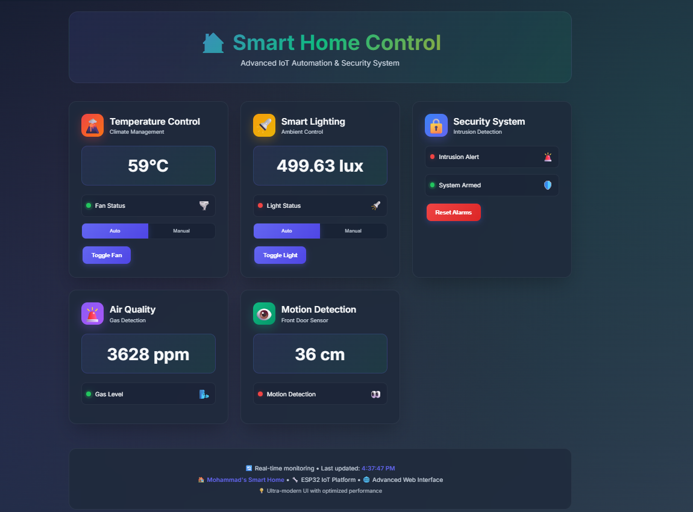
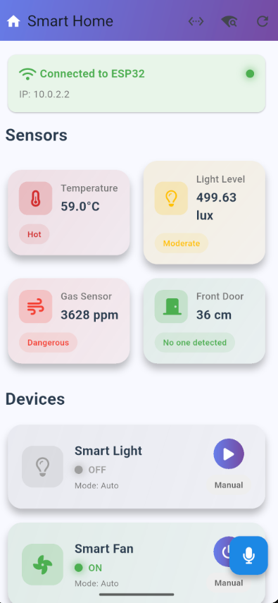
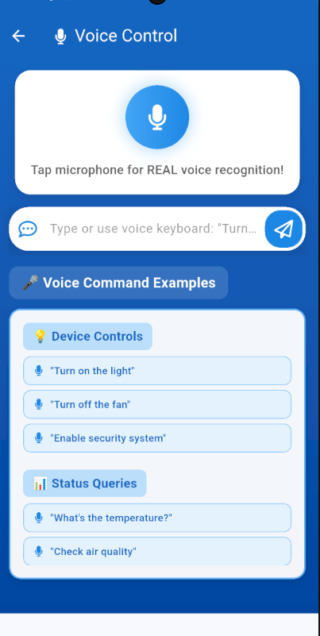
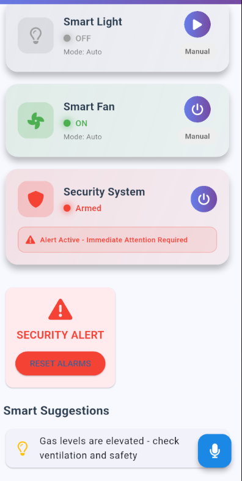
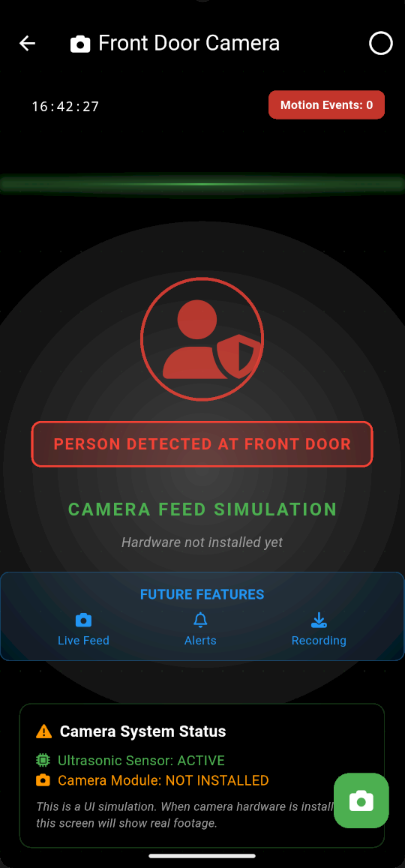

# Smart Home Automation

A local-network smart home system built around an ESP32, a responsive web dashboard, and a Flutter mobile application with voice control.

The project supports two development modes:

- **Wokwi simulation** for running the ESP32 firmware without physical hardware.
- **Physical ESP32 hardware** connected to sensors and actuators.

The web dashboard and mobile application communicate directly with the ESP32 over HTTP. No cloud service or external API is required.

## Highlights

- Live temperature, light, gas, and distance monitoring
- Servo-controlled fan and relay-controlled lighting
- Automatic and manual operating modes
- Touch, motion, and gas safety alerts
- Responsive ESP32 web dashboard
- Flutter mobile application for Android and iOS
- Voice commands and text-based command input
- Local-network operation with no cloud dependency
- OLED display, LEDs, and buzzers for local feedback

## Screenshots

### Web dashboard



### Mobile dashboard



### Voice control



### Security alert



### Camera screen simulation



> The camera screen is currently a UI simulation. The hardware project does not include an installed camera module or a live camera feed.

## System Architecture

```text
+----------------------+       HTTP on local network       +----------------------+
| Web browser          | --------------------------------> |                      |
| Flutter mobile app   | --------------------------------> | ESP32 web server     |
+----------------------+                                  |                      |
                                                          | Sensors and inputs   |
                                                          | Relays, servo, LEDs  |
                                                          | Buzzers and OLED     |
                                                          +----------------------+
```

The ESP32 web server listens on port `80`. Wokwi forwards that port to port `8180` on the development computer.

## Hardware

| Component | Purpose | Pins |
| --- | --- | --- |
| ESP32 DevKit-C-V4 | Main controller | - |
| DHT22 | Temperature and humidity | GPIO 33 |
| LDR | Light level | GPIO 32 |
| MQ2 | Gas and smoke level | GPIO 34 |
| HC-SR04 | Distance and motion simulation | Trigger GPIO 15, Echo GPIO 2 |
| Servo motor | Fan simulation | GPIO 17 |
| Relay module | Light control | GPIO 16 |
| Push button | Touch/security input | GPIO 4 |
| Smoke LED | Gas warning indicator | GPIO 5 |
| Touch LED | Touch warning indicator | GPIO 19 |
| Motion LED | Motion indicator | GPIO 18 |
| Smoke buzzer | Gas alarm | GPIO 14 |
| Touch buzzer | Touch alarm | GPIO 27 |
| SSD1306 OLED | Local status display | SDA GPIO 21, SCL GPIO 22 |

The complete circuit is available in [diagram.json](diagram.json).

## Requirements

### Firmware and simulation

- VS Code with PlatformIO, or PlatformIO Core
- Wokwi CLI for simulation
- ESP32 board and the components listed above for physical deployment

### Mobile application

- Flutter SDK
- Android Studio or an Android/iOS device
- A microphone-enabled device for voice control

## Quick Start: Wokwi

From the repository root:

```bash
pio run
wokwi-cli --start
```

For browser and mobile connection addresses, see [Connection Setup](#connection-setup). The address printed by the simulated device belongs to Wokwi's internal network and is not the host address used by other devices.

### PlatformIO commands

```bash
# Build the firmware
pio run

# Upload to a physical ESP32
pio run --target upload

# Open the serial monitor
pio device monitor
```

## Quick Start: Flutter app

```bash
cd smart_home_app
flutter pub get
flutter run
```

For a release APK:

```bash
flutter build apk --release
```

The app includes connection settings, sensor and device controls, voice control, security alerts, and local suggestions based on sensor readings.

## Connection Setup

Use the address that matches the client and the target environment:

| Client | Target | Address |
| --- | --- | --- |
| Browser on the Wokwi computer | Wokwi | `http://localhost:8180` |
| Phone on the same Wi-Fi as the Wokwi computer | Wokwi | `http://<COMPUTER_LAN_IP>:8180` |
| Example using computer IP `192.168.0.10` | Wokwi | `http://192.168.0.10:8180` |
| Android emulator | Wokwi on the host computer | `http://10.0.2.2:8180` |
| Browser or app on the same LAN as a physical ESP32 | Physical ESP32 | `http://<ESP32_IP>/` |

When configuring the mobile app, enter only the host/IP value, such as `192.168.0.10`. The app adds port `8180` for the Wokwi host setup. The phone and computer must be on the same Wi-Fi network, and Windows Firewall must allow inbound TCP traffic on port `8180`.

For physical hardware, configure the Wi-Fi credentials in `src/main.cpp`, wait for the ESP32 to connect, and use the IP printed by the serial monitor. Never commit real Wi-Fi credentials to the repository.

## Voice Commands

The app supports natural-language commands such as:

- `Turn on the light`
- `Turn off the fan`
- `Enable security system`
- `Switch to manual mode`
- `What's the temperature?`
- `Check air quality`
- `Reset alarms`

Voice recognition requires microphone permission. Text commands can also be entered from the voice control screen.

## HTTP API

The ESP32 exposes the following endpoints. With Wokwi, prepend `http://localhost:8180`; with physical hardware, prepend `http://<ESP32_IP>`.

| Method | Endpoint | Purpose |
| --- | --- | --- |
| `GET` | `/` | Web dashboard |
| `GET` | `/data` | Current sensor and device data |
| `GET` | `/mobile/status` | Mobile-oriented system status |
| `POST` | `/voice` | Process a voice command |
| `POST` | `/control` | Send a general control command |
| `POST` | `/mobile/light/toggle` | Toggle the light |
| `POST` | `/mobile/fan/toggle` | Toggle the fan |
| `POST` | `/mobile/security/toggle` | Toggle the security system |

The API currently has no authentication and is intended for trusted local networks only. Do not expose the Wokwi port or a physical ESP32 directly to the public internet.

## Project Structure

```text
.
├── diagram.json              # Wokwi circuit and wiring definition
├── platformio.ini            # PlatformIO configuration
├── wokwi.toml                # Wokwi firmware and port forwarding configuration
├── src/main.cpp              # ESP32 firmware and web API
├── lib/                      # Local embedded libraries
├── smart_home_app/           # Flutter mobile application
├── docs/screenshots/         # README screenshots
└── test/                     # Embedded project test resources
```

## Troubleshooting

### The web page does not open

- Confirm that the firmware was built with `pio run`.
- Confirm that Wokwi is running with `wokwi-cli --start`.
- Use port `8180` for Wokwi; the simulated IP printed by the serial monitor is not the host address.
- From a phone, use the computer's LAN IP and ensure both devices are on the same Wi-Fi.
- Allow inbound TCP port `8180` in Windows Firewall if the computer is reachable locally but not from the phone.

### The mobile app cannot connect

- Use the address listed for your client and target in [Connection Setup](#connection-setup).
- Android Emulator and a physical phone use different host-network routes; do not substitute one address for the other.
- For physical hardware, use the IP printed by the ESP32 serial monitor.
- Use the app's connection test after changing the address.

### Voice control does not work

- Grant microphone permission to the application.
- Check that speech recognition is available on the device.
- Use the text input as an alternative to microphone input.

## Security Notes

- Keep Wi-Fi credentials out of source control.
- Use this project only on a trusted local network unless authentication and transport security are added.
- Do not forward port `8180` from a router to the public internet.
- The current `/control` and toggle endpoints do not authenticate requests.

## License

This project is licensed under the [MIT License](LICENSE).

## Acknowledgments

- [Espressif](https://www.espressif.com/) and the ESP32 community
- [Flutter](https://flutter.dev/)
- [PlatformIO](https://platformio.org/)
- [Wokwi](https://wokwi.com/)
- Adafruit libraries used by the firmware
